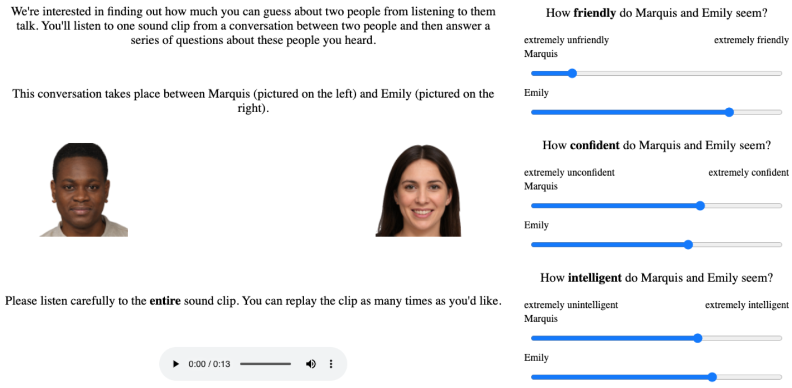

```{r setup, echo = FALSE, message = FALSE}
library("knitr") # for knitting things
library("tidyverse") # for all things tidyverse
library("dplyr")
library("pwr")
library("lme4")
library("lmerTest")
library("ggplot2")
library("bootstrap")
library("tm")

# these options here change the formatting of how comments are rendered
opts_chunk$set(
  comment = "",
  results = "hold",
  fig.show = "hold")

# include references for used packages
write_bib(.packages(), "Thesis-writeup/references/packages.bib") 

#set the default ggplot theme
theme_set(theme_bw())
```

<!-- Figure captions -->

(ref:fig1caption) Residualized reading times showed a slowdown in reading times in the critical and early spillover regions regardless of whether the name/continuation pairing evoked the criminality stereotype; however this pattern was more pronounced in sentences containing White-normed names. Error bars indicate bootstrapped 95% confidence intervals.

(ref:fig2caption) In this version of the self-paced reading paradigm, the sentences are identical to those presented in Experiment 1 but presented alongside a Black or White face  and the sentence \'This is [NAME].\'

(ref:fig3caption) Residualized reading times showed no significant difference in their slowdown in the critical/spillover regions when the sentence contained a Black- vs. White-normed name, regardless of the condition they were in. \'Black-typical\' items evoked the criminality stereotype, whereas \'White-typical\' items did not. Error bars indicate bootstrapped 95% confidence intervals.

(ref:fig4caption) The presentation of the speakers, faces, and audio stimulus (left) and a few select survey questions (right). This mirrors the design of Hilton (2018).

(ref:fig5caption) Participant ratings of interruptiveness and prosocial engagement showed no effects of race and gender when judging speakers who agreed with their interlocutor; however, White male interrupters were rated as significantly more prosocial and less aggressive than any other race and gender combination of interrupters in the interruptive condition. Facets correspond to the judged trait, error bars indicate bootstrapped 95% confidence intervals.

(ref:fig6caption) Participant ratings, here shown as the difference between the interruptive and agreeable conditions, for the four possible race/gender combinations of a potential speaker being judged. White males were consistently penalized the least across these four traits. Error bars indicate bootstrapped 95% confidence intervals.

(ref:fig7caption) Histogram of responses for the 5-point Likert scale indicating explicit preferences for both race (above) and gender (below). Participants were given the prompt 'in your ideal world, this description would apply more to…' and then provided a judgment ranging from one race/gender to the other. The high concentration of responses towards the neutral response meant that the data on either extreme was not sufficient in size to conduct any analysis on participants holding any non-neutral racialized/gendered views.

```{r figure-captions, echo = FALSE}
fig1caption <- "Residualized reading times showed a slowdown in reading times in the critical and early spillover regions regardless of whether the name/continuation pairing evoked the criminality stereotype; however this pattern was more pronounced in sentences containing White-normed names. Error bars indicate bootstrapped 95% confidence intervals."
fig2caption <- "In this version of the self-paced reading paradigm, the sentences are identical to those presented in Experiment 1 but presented alongside a Black or White face  and the sentence 'This is [NAME].'"
fig3caption <- "Residualized reading times showed no significant difference in their slowdown in the critical/spillover regions when the sentence contained a Black- vs. White-normed name, regardless of the condition they were in. \'Black-typical\' items evoked the criminality stereotype, whereas \'White-typical\' items did not. Error bars indicate bootstrapped 95% confidence intervals."
fig4caption <- "The presentation of the speakers, faces, and audio stimulus (left) and a few select survey questions (right). This mirrors the design of Hilton (2018)."
fig5caption <- "Participant ratings of interruptiveness and prosocial engagement showed no effects of race and gender when judging speakers who agreed with their interlocutor; however, White male interrupters were rated as significantly more prosocial and less aggressive than any other race and gender combination of interrupters in the interruptive condition. Facets correspond to the judged trait, error bars indicate bootstrapped 95% confidence intervals."
fig6caption <- "Participant ratings, here shown as the difference between the interruptive and agreeable conditions, for the four possible race/gender combinations of a potential speaker being judged. White males were consistently penalized the least across these four traits. Error bars indicate bootstrapped 95% confidence intervals."
fig7caption <- "Histogram of responses for the 5-point Likert scale indicating explicit preferences for both race (above) and gender (below). Participants were given the prompt 'in your ideal world, this description would apply more to…' and then provided a judgment ranging from one race/gender to the other. The high concentration of responses towards the neutral response meant that the data on either extreme was not sufficient in size to conduct any analysis on participants holding any non-neutral racialized/gendered views."
```

\newpage
# Introduction: Racialized attitudes in language processing and speaker judgment
Racial biases play a significant role in shaping American society. From influencing how likely someone is to get a job offer [@bertrand2004emily], how likely preschool students are to be suspended or expelled by their teachers [@gilliam2016early], or how likely a police officer is to search drivers and use respectful language towards them in a traffic stop [@pierson2020large; @voigt2017language], these biases and the structural racism that both shapes and perpetuates them influence every level of society in the United States. Addressing and abating structural racism is a longstanding cultural, political, economic, and indeed moral enterprise in the U.S., one that has also given rise to a corresponding scientific enterprise focused on answering questions such as: why do we transmit racial biases? How exactly do these attitudes shape social interactions and, ultimately, allow for “an enduring racial hierarchy that has persisted for centuries” [@wilkerson2020america]?

To fully understand the relationship between racial bias and linguistic practice, we must understand how racial bias interacts with the underlying cognitive mechanisms responsible for perceiving and making sense of the world around us. Linguistic practice emerges as an especially salient cognitive process, as communication provides a clear environment in which an individual agent integrates their beliefs about the world and others at the cognitive level. So, we may ask, how do racialized beliefs modulate the ways in which language is produced and comprehended by the individual? The subfield of linguistics where race and language have been studied most extensively is sociolinguistics. Research has focused on how language variation communicates identities and group membership, including race and gender [@alim2012articulate; @eckert2013language]. The third wave of sociolinguistics focuses, in part, on starting at the individual level and individual variation; this variation aggregates and, via feedback, shapes macro-level societal perceptions and attitudes. Studying this variation that “does not simply reflect, but also constructs, social meaning and hence is a force in social change” [@eckert2012three] suggests that an individual’s use of language both reflects and constructs larger-scale ideologies, including racial identity [@king2018exploring]. With a few notable exceptions [e.g., @mengesha2018interaction; @mengesha2019talker; @weissler2022meeting], race has been less studied in formal semantics and pragmatics, and psycholinguistics. I seek to apply a similar shift towards the individual in the study of race and language in these domains. Looking at the individual level allows us to understand how pragmatic and language processing behaviors aggregate to a larger scale and influence the way we construct and digest race and racism.

This thesis investigates whether and how racial stereotypes, as triggered by stereotypically Black versus stereotypically White names and faces, are reflected in language comprehension and speaker judgments. In three experiments, I measure whether stereotypical beliefs are measurable in a self-paced reading task (Exp. 1 & 2), as well as whether race (and gender) are additive factors in the penalization of interruptive speakers aligned with existing stereotypes (Exp. 3). In the experiments concerned with language processing and reading times, there was no evidence for the activation of racial stereotypes. However, in the speaker judgment paradigm, I find effects of race on the judgment of how prosocial, intelligent, and aggressive speakers are judged to be when interrupting. In the General Discussion, I discuss possible explanations for the difference between these paradigms, as well as the implications of the results concerned with speaker judgments.

# Language Processing: Experiments 1 & 2
## Background
### Prior beliefs and reading times
The study of reading times has emerged as one area of language processing in which implicit beliefs and the integration of world knowledge in producing and parsing language production and comprehension have been studied. Studies such as the seminal Brown and Dell (1987) have shown that how typical people believe an instrument to be in a given context of a story affects the probability with which the instrument is mentioned while retelling the story: more atypical instruments are more likely to be mentioned. From the original study and others building off of Brown and Dell’s findings, the perceived typicality of an object has been shown to play a role in language production [@brown1987adapting; @lockridge2002addressees; @westerbeek2015stored; @degen2020redundancy]. Typicality expectations have also been shown to affect language comprehension: more atypical items are read more slowly than typical items [@brown1987adapting; @lockridge2002addressees].

Racialized stereotypical associations and beliefs can be seen as an instance of prior beliefs language users hold about the world. Previous research points to linguistic information that aligns with these prior beliefs — similar to perceiving an object to be “typical” in Brown & Dell (1987) — is processed more easily and read more quickly. For instance, studies examining gendered expectations have been shown to produce differences in reading times; von der Malsburg, Poppels, and Levy (2020) show that ‘she’ pronouns were read more slowly than ‘he’ pronouns to refer back to “the president,” presumably because of a strongly activated gender stereotype of a president being male. Additionally, it has been shown that co-referring pronouns are read more slowly and fixated on more when they do not align with the stereotypical gender of the profession in question, such as *he* for nurse or *she* for electrician [@duffy2004violating; @kerr1984fixation]. If we expect racialized biases and stereotypic beliefs to serve as the world knowledge a listener brings to bear in language processing, items that evoke a race-based stereotype should be processed more easily in a sentence continuation that is consistent with that stereotype, compared to continuations that are not. To investigate this prediction, I used stereotype-consistent and -inconsistent items in two self-paced reading tasks (Experiments 1 and 2). Reading times were used in previous work on typicality and comprehension; norming work conducted by Brown and Dell (1987) and Lockridge and Brennan (2002), in which they used a pretest phase measuring reading time for sentences containing “typical” and “atypical” instruments, found that sentences containing atypical information were read more slowly (6081ms for atypical sentences compared to 5419ms for sentences containing typical items).

### The criminality stereotype
In the realm of racialized stereotypical associations and beliefs, I concentrate here on the stereotype linking Blackness to criminality. Extensive research has demonstrated its prevalence in the United States [@hurwitz1997public; @maclin2006criminal; @sap2019social]. Due to this strength and prevalence, I considered language that is consistent with this criminality stereotype — such as sentences that evoke the notion of criminality with a stereotypically Black name as a subject — to align with prior beliefs. This can be compared to language that might violate these beliefs, such as a sentence that evokes criminality where the subject has a stereotypically White name. Again, following work on the role of prior beliefs in language comprehension, I expected sentences that evoked the criminality stereotype to have higher reading times when they contained stereotype-inconsistent name/continuation pairs — such as a White-normed name as the subject and a word/phrase that evoked the racialized crime stereotype — than those that contained stereotype-consistent name/continuation pairs.

## Experiment 1: Reading time study using the criminality stereotype
In a first series of experiments, I attempted to examine the relationship between stereotypicality and typicality, namely if lexical items that evoke the Black/crime stereotype are read more quickly in accordance with existing accounts of processing “typical” information [@brown1987adapting; @lockridge2002addressees] — I sought to test whether participants show facilitated processing of stereotype-congruent compared to incongruent sentences.

### Methods
#### Participants
I recruited 180 participants on Prolific, all of whom were based in the United States, spoke English as their first language, and were between the ages of 18 and 73. They had all completed a minimum of 1,000 experiments on Prolific prior to the experiment, and were paid $1.25, as an initial small, five-person pilot suggested an average completion time of about 5 minutes.

#### Procedure
Participants were given the premise of having to read snippets from different stories an author is writing, clicking the spacebar to read the words one-by-one in a self-paced moving window display [@just1982paradigms]. In addition to the sentence being revealed word-by-word, there was an introductory sentence that established the story’s context. These two-sentence stories presented eight critical prompts of interest that contained a subject with either a Black-normed name or White-normed name. Each sentence also contained a critical word/phrase that either evoked or did not evoke the notion of criminality. After reading the target sentence, participants were asked to answer a yes/no comprehension question about the semantic content of the sentence. In addition, participants saw ten filler prompts that showed similar response patterns in the sentence completion task.

Participants were presented with two sentences comprising of a “snippet,” where the second sentence — containing the critical item — was initially masked, and revealed on a word-by-word basis as the participant advanced through the sentence using a space bar to move to the next word [@just1982paradigms]. After reading the critical sentence, both the critical and contextual sentences disappeared and the participant answered a question about the sentences’ semantic content to ensure they were comprehending the sentences and paying attention. Additionally, I included a debrief slide after the submission of all data providing some context to the study and explaining our interest in the racialized criminality stereotype and its association with Black men.

#### Materials
Using words whose (pre-trained word2vec) vector representations are close (cosine distance) to the word criminal, I created stimuli that either evoked (1a) or did not evoke (1b) the notion of criminality. These sentences were minimal pairs, with the difference of the critical word (italicized for effect in this paper) determining whether the sentence evoked the notion of criminality (See Appendix, Table 1 for a full list of stimuli).

1.  
  (a) It had been a while since Deandre/Tanner had visited his cousin. Deandre/Tanner decided to go visit him at the local jail in a few days, which was just a short drive away.  
  (b) It had been a while since Deandre/Tanner had visited his cousin. Deandre/Tanner decided to go visit him at the local college in a few days, which was just a short drive away.  

To obtain the names, I selected the 15 most Black- and most White-normed names from Stelter and Degner (2018). These names were randomly presented as the subject of the sentences in the snippet, so that each participant would see an even mix of White and Black names.

I wished to collect an average of 40 responses per critical sentence per consistency (this amounts to an average of 160 responses / sentence, as sentences can be Black-consistent, White-consistent, Black-inconsistent, or White-inconsistent). I include an additional 20 participants on the assumption that some will fail our exclusion criteria.

### Results
I analyzed data looking at the reading time — log-transformed and length-corrected — of sentences’ critical regions. The critical regions consisted of the manipulated item, which either evoked or did not evoke the notion of criminality. Additionally, the words immediately following the critical region, referred to as the spillover region, were also analyzed as research has pointed to a delayed effect of a given item on reading times that “spills over” to the subsequent words [@just1982paradigms]. Research using the self-paced reading task paradigm has demonstrated that participants read items more quickly as they advance in the experiment and adapt to the self-paced reading task [@jegerski2014self], which I refer to as the “order” of a specific stimulus.

#### Exclusions
18 participants who answered fewer than 80% of the comprehension questions correctly were excluded, leaving 162.

#### Model structures
To assess whether stereotype consistency affected reading times differently for Black and White normed names, I conducted two linear mixed effects regressions. The first predicted log-transformed length-residualized reading time from the three-way interaction of mean-centered values for: order (the trial number within a given experiment, log-transformed), name bias (Black-/White-normed name as a subject, with Black-normed name as the reference level), and stereotype consistency (consistent/inconsistent, with consistent as the reference level). The second predicted log-transformed residualized reading time from the three-way interaction of mean-centered values for: order, name bias, and criminality (evoking/not evoking the notion of criminality, with evoking criminality as the reference level). This was done using the lmer package in R, with by-item and by-participant random intercepts.

#### Stereotype consistency & criminality
There was a significant negative main effect of stereotype consistency on residualized reading times ($\beta$ = -0.109, *SE* = 0.034 , *p* < 0.01), suggesting that stereotype-inconsistent items were read more quickly by participants. When looking at criminality as a predictor, there was a significant effect of the interaction between name bias and criminality on reading times: reading times were greater (i.e. items were read more slowly) for items that contained White-normed names and did not evoke the idea of criminality ($\beta$ = .054, *SE* = 0.017, *p* < 0.01). Both models also showed that reading times decreased as participants advanced through the study, which is consistent with previous work on reading times.

These findings go against the expected results; the notion that items violating users’ held prior beliefs (stereotype-inconsistent items) was surprising. Additionally, the interaction between name bias and criminality significantly affected reading times, suggesting that this main effect was driven explicitly by White-normed names matched with items not evoking criminality being read more slowly and therefore harder to process. The small effect sizes here, combined with a sample size that did not allow for any more complex models (such as including by-item and by-participant random slopes for the fixed effects) left us unable to disprove the null hypotheses.  

```{r Exp1-results, echo=FALSE, fig.cap='(ref:fig1caption)', out.width="80%", fig.align ="center"}  

include_graphics("Thesis-writeup/figures/Fig1.png")

```

## Experiment 2: Including face stimuli
One potential explanation for the lack of the expected effects when measuring the impact of race and stereotypic conformity on reading times could be due to names alone being too weak of a cue to evoke the idea of race. Other perceptual studies focusing on the effects of racialized stereotypes on implicit cognition, such as Eberhardt et al.’s “Seeing Black” (2004), evoked the notion of race using Black and White faces. Through implicit priming, the studies showed both that seeing Black faces accelerated participants’ ability to spontaneously detect degraded images of crime-relevant objects (where seeing White faces did not), and that activating race-consistent stereotypes about Black men including criminality and basketball induces attentional biases toward Black male faces. Thus, I sought to combine the normed names with images of faces in the hopes of better evoking the idea of race and, as a result, more representationally measure the desired “world knowledge” or “prior beliefs” of racialized stereotypes in participants.

### Methods
#### Participants
As in Experiment 1, I recruited 180 participants on Prolific, all of whom were based in the United States, spoke English as their first language, and were between the ages of 18 and 52. They had all completed a minimum of 1,000 experiments on Prolific prior to the experiment, and were paid $1.50, as an initial small, five-person pilot suggested an average completion time of about 6 minutes.

#### Procedure
The procedure was almost identical to that of Experiment 1; the same self-paced reading paradigm was used with comprehension questions. The crucial difference involved presenting the participant with a Black or White face in addition to the name of the sentences’ subject. Figure 2 illustrates how the subject was “introduced” prior to the self-paced reading task.  

```{r Exp2-procedure, echo=FALSE, fig.cap='(ref:fig2caption)', out.width = "80%", fig.align="center"}  


```

#### Materials
The linguistic stimuli, fillers, and comprehension questions remained identical to those presented in Experiment 1. The faces were artificially generated and normed, obtained from https://generated.photos/faces. The face and name always matched in the presented race, but the specific combinations of faces and names were shuffled for each participant (and faces were not re-used, so that participants did not build up a conception of some specific person with a given face over the course of the experiment).

### Results
As in Experiment 1, I analyzed the data to look at residualized, length-corrected reading times in both the critical regions and the following spillover regions.

#### Exclusions
11 participants who answered fewer than 80% of the comprehension questions correctly were excluded, leaving 169.

#### Model structures
To assess whether stereotype consistency affected reading times, I conducted linear mixed effects regressions. A first model predicted the reading times of items in the critical region from the three-way interaction of order (the trial number within a given experiment, log-transformed), name bias (Black-/White-normed name as a subject, again with Black-normed names as the reference level), and stereotype consistency (consistent/inconsistent, with consistent as the reference level). And, just as in Experiment 1, a second model predicted reading times from the interaction of order, name bias, and criminality (evoking/not evoking the notion of criminality, with evoking criminality as the reference level). I conducted two additional models focusing just on the spillover region, after exploratory analyses suggested that a reading time slowdown was more pronounced in the spillover regions than the critical region. All models were done using the lmer package in R, with by-item and by-participant random intercepts.

#### Critical region
All models including the reading times of items in the critical region showed no effects for any of the main variables of interest, whether stereotype consistency ($\beta$ = -0.046, *SE* = 0.050 , *p* = 0.24) or criminality ($\beta$ = -0.056, *SE* = 0.050 , *p* = 0.27) was included in the linear mixed effects regression model. The three-way interactions measured in each model, additionally, did not show any significant effects on reading times. Both models also showed that reading times decreased as participants advanced through the study, which is consistent with previous work on reading times.

#### Spillover region
In exploratory models focusing solely on the spillover region, there was an observed small significant negative main effect of the interaction between order, name bias, and consistency ($\beta$ = -0.0881, *SE* = 0.035 , *p* < 0.05). This suggests that spillover regions were read more quickly when they contained stereotype-inconsistent items and Black-normed names. However, this significant effect was not replicated when looking at criminality as a main effect ($\beta$ = -0.0468, *SE* = 0.035 , *p* = 0.18), suggesting that there is no significant effect on reading times of items that contain Black-normed names and do not evoke the notion of criminality. Both models, again, showed that reading times decreased as participants advanced through the study.  

```{r Exp2-results, echo = FALSE, fig.cap = '(ref:fig3caption)', out.width = "80%", fig.align ="center"}  


```

## Discussion of Experiments 1 & 2
Across Experiments 1 and 2, I investigated whether implicit beliefs are reflected in indirect measures of language processing using expectations resulting from racialized stereotypes. The findings suggest that information that went along with commonly-held stereotypes, if anything, was read more slowly and therefore processed less easily. These stereotype-consistent sentence completions being read more slowly in Experiment 1 was a surprising finding given previous work on prior beliefs and reading times expectations [@brown1987adapting; @lockridge2002addressees]. This would suggest that the stereotype held by participants was associating Whiteness with criminality in Experiment 1; however, literature on the stereotypic link between Blackness and criminality — as well as this effect not being borne out when faces were introduced in Experiment 2 — indicates this is not an appropriate conclusion from the data.

Whether or not faces were presented, I was unable to detect expected effects of stereotype-consistent continuations and items being read more quickly than stereotype-inconsistent continuations. An exploratory investigation into possible modulation of effects by participant demographics, including race, political affiliation, and age, revealed no significant patterns that would disprove any of the null hypotheses. From this data, I am left with the question of, if these stereotypes are in fact held, what is preventing them from emerging in any of these processing tasks. In a similar study, Papineau et al. (2022) investigated the effects of gendered beliefs on reading times, finding no evidence that ideological beliefs about gender and its binary social roles modulate the processing of gender-neutral language. Additionally, von der Malsburg’s results, which found no processing advantage for the pronoun which co-referred with the real-world gender of the expected election winner [@von2020implicit]. These results, alongside the current findings, have failed to find effects of multiple forms of prior beliefs — both gendered and racialized — on language processing using the self-paced reading time paradigm. However, other studies showing the paradigm’s effectiveness in this domain [@duffy2004violating; @kerr1984fixation] suggests that the current study may suffer from low statistical power and an unknown number of Type 2 errors. The question of why I was unable to disprove the null hypotheses in this study and conclude that racialized judgments elicit a difference in reading times remains an area to be further explored. One potential issue is that the cue to a speaker’s identity using their first name, or an image, is not strong enough and does not mimic the social nature of interpersonal interaction or communication in which people bring these implicit beliefs to bear. Hamedani and Markus’ notion of the *culture cycle* describes racialized attitudes and beliefs as inherently social processes, wherein culture and race are the products of dynamic interactions between institutions, interactions, and — crucially — individuals [@hamedani2019understanding]. Given the lack of results of the self-paced reading task experiments targeting the effects of prompted race on language processing in Experiments 1 and 2, I sought to examine a behavior that more closely mirrored such a dynamic interaction.

# Speaker Judgments: Experiment 3
## Background
To better mimic the social communication in which people might involve their implicit beliefs, I shifted to focusing on listeners judging speakers based on their speech in interaction. This focus on interacting with another person is motivated by the conceptualization of race as a social process, building on the idea that differences emerge between races as a result of the different social processes people of different races engage with, by both doing and having different actions done to them [@moya2011doing].

### Motivation & methods for analyzing social interactions
This decision to shift our focus to a setting that more explicitly involves social interaction, as opposed to more individualistic processing, involves a greater discussion of how to analyze social interactions in an experimental setting.

When studying social perception in these settings, participants are tasked with observing and judging an interaction that does not directly involve them. In a role similar to what Goffman (1981) describes as an *unratified overhearer*, we can characterize these participants as almost eavesdropping on the interaction/conversation they listen to in an experimental setting. As such, we can liken the behavior of participants in social interaction experiments to that of people overhearing any public conversation between strangers. Social psychologists have suggested that eavesdroppers are quick to infer character traits [@winter1984social] and social roles [@chen2014spontaneous], doing so spontaneously based on strangers’ behaviors and interactions, such as conversations. It is worth noting that in social settings, but not necessarily in the more artificial setting of an online experiment, these inferences about strangers can play an important role in how people form impressions about each other, in turn playing a significant role in informing who they respect, get along with, or treat poorly.

While studying language perception offers insights into how different conversational roles, practices, and identities of interlocutors affect the impressions people form about each other, there remains the issue of the authenticity of the social interactions used in experimental settings. By its very nature, language produced for the purpose of an experiment can be argued to compromise the naturally occurring structure and style of spontaneous conversation in ways incredibly hard to measure [@schegloff1996issues]. However, these social interactions that take place — or are observed — in laboratory contexts could very well exist as a different kind of interaction and be comparable to the spontaneous conversations it mimics when it comes to the domain of conversation analysis [@kendrick2017using].

#### Previous work on faces and speech perception
While conversational contexts allow for listeners to bring these biases to bear on how they judge a speaker from the language they use, the inverse is also the case: listeners can and will judge an interlocutor’s language based on their social characteristics including race. With little research having been conducted on the effects of race on how a speaker is perceived as a person,^[Studies of race and perception relating to conversations often focus on how listeners construct and judge racialized identities from a speaker's language [e.g., @walton1994speaker], or how speaker race affects the perception of the speech itself [e.g., @schweinberger2014speaker].] the judgment of their language provides the existing basis for the effects of race on any sort of speaker-related judgment.

This phenomenon is best documented by what Okim Kang and Donald Rubin refer to as reverse linguistic stereotyping, wherein listeners judge a speaker’s language, and will often perceive that language differently, as a function of the speaker’s apparent racial identity [@kang2009reverse]. As the “third wave” of sociolinguistic framing deals with constructing ideological meaning from variation in language production, this notion of reverse linguistic stereotyping touches on another side to the idea of ideological construction by focusing on how non-linguistic indices of identity contribute to a speaker’s perceived linguistic features or variation. This concept is rooted in a series of experimental findings from Rubin examining how White students judged the intelligibility and intelligence of a hypothetical teaching assistant; they paired a natively accented American English voice with a photo of either a White or East Asian male (presented as a teaching assistant) and asked participants to evaluate the voice/photo pairing on accentedness and teaching quality [@rubin1990effects; @rubin1992nonlanguage; @kang2009reverse]. In doing so, they found that students rated the same speech streams as more accented and of a lower teaching quality when they were presented with an East Asian male’s photo than with a White male’s photo. This visual information, the perception of race without any of the linguistic cues or accents present in the aforementioned discussion of linguistic profiling, still managed to trigger race-dependent judgments.

This effect, the degree to which reverse linguistic stereotyping occurs, seems to be modulated by the listener’s upbringing and experiences with people of other races. When a similar task to that used in Rubin & Smith (1990) was presented to groups of participants in Gainesville, Florida (USA) and Montreal, Quebec (Canada) — participants were played American, British, and Indian English speech streams and presented with either White or South Asian faces— a similar effect was observed [@kutlu2022does]. In the less diverse locale of Gainesville, listeners found the speech streams less intelligible, and more accented when paired with a South Asian face than with a White face, whereas in the more diverse Montreal listeners did not exhibit any differences in intelligibility or accentedness between the two conditions. Given that accented speech is often a proxy for out-group membership and judged negatively across a variety of social traits, these judgments could very well serve as an indicator of the negative attitudes listeners potentially express about interlocutors of different races based on their language alone [@ng2007language].

#### Interruptiveness
Hilton’s (2018) study of interruptions provides an excellent paradigm for eliciting judgements about speakers and social interactions in an experimental setting. In the 2018 study, Hilton examined how listeners come to the interpretation that an interruption has occurred in conversation. This study focused on the effects of, among other dimensions, overlapping speech, prosodic style, and pragmatic relations on the perceived interruptiveness of an interlocutor. After listening to a conversation between two speakers, participants provided judgments across a variety of scales, including how polite, interruptive, agreeable, intelligent, and in control they thought each speaker to be, as the final turn of the conversation varied across the aforementioned dimensions. In relation to overlapping speech, the final turn of the conversation ranged from not overlapping with the penultimate turn at all to an extended overlap. The manipulations of pragmatic relations saw the final turn either exhibit stance alignment, wherein the final speaker agreed with what had just been said, stance disalignment, where they disagreed, or abruptly shift the topic, where they change the topic of conversation without warning. From these manipulations, Hilton found that listeners perceived speakers to be most interruptive when:

  - They began their turn in the middle of another speaker's ongoing turn and persisted in overlap for four words, or five syllables (extended overlap).
  - They disagreed with their interlocutor or abruptly changed the topic of conversation (stance disalignment, abrupt topic shift).
  
On the other hand, the most agreeable (or least interruptive) conversations contained no overlap and stance alignment.

Additionally, Hilton (2022) explored the effects of speaker gender on the participants’ judgments from the variety of provided scales; these judgments suggested that female speakers are perceived to be less friendly, less intelligent, and more dismissive than male speakers. Importantly, this also involved female speakers being penalized more harshly for using more interruptive styles (again referring to overlapping speech and abruptly shifting the topic) than male speakers. This idea of penalization refers to the difference between the rating of a speaker’s perception in an interruptive and agreeable condition. The study also asked participants for their explicit judgments of men and women; it presented them with a list of descriptions (competitive, polite, good listeners, interrupt other people often, get interrupted often) and asked them to indicate whether, in their own ideal world, each description should apply equally to women and men, more to men, or more to women. However, there were no observed effects of these explicit attitudes on speaker evaluations [@hilton2022lsa].

With this paradigm introduced by Hilton (2018), there exists a method for eliciting judgements about speakers in a context involving speech streams, wherein participants might more directly bring their prior beliefs (i.e. gendered or racialized attitudes) to bear in their evaluation of these recorded conversations and interruptions. The linguistic phenomenon of interruptions is especially relevant in the evaluation of racialized and gendered attitudes because of the social costs associated with interruptions: because listeners already view interruptive speech as costly, the introduction of race and gender into interruptive contexts allows for an examination of how the costliness of this discursive move may be exacerbated by listener ideologies about specific identities. Interruptions also only occur in interpersonal interactions, providing a more social context into which listeners might bring these judgments to bear.

## Experiment 3: Judging interruptive speakers
I sought to build on the paradigm coined by Hilton (2018) by introducing the race of an interruptor as an additional variable in eliciting participant judgments of interrupters. Given the results from the original paradigm, I expected female speakers to be judged more negatively for interrupting, and penalized more harshly for interrupting. The main question of interest is how race interacts with gender. One possibility is that race and gender are additive effects, such that Black interrupters are judged more negatively than White interrupters across a variety of prosocial attributes including engagement, friendliness, and agreeability, as well as being judged to be more interruptive than White interrupters. This would predict harshest penalties for Black female speakers and least harsh penalties for White male speakers. Alternatively, there may be more complex interactions of race and gender, or no effects of race at all.

### Methods
#### Participants
We recruited 650 participants on Prolific, all of whom were based in the United States, spoke English as their first language, and were between the ages of 18 and 80 years old. They had all completed a minimum of 1,000 experiments on Prolific prior to this experiment, and were paid $1.35, as an initial small, five-person pilot suggested an average completion time of about 6 minutes.

#### Procedure
Participants were told to listen to an audio clip and answer questions about the social interaction. After first being introduced to the conversation’s speakers (with both a name and face), participants provided a brief description of the speakers and then answered a series of questions about each (and both) conversant(s) using a series of slider scales. The audio clip presented a situation wherein one interlocutor, the first speaker in the clip (referred to as A for clarity here), either interrupts and disagrees with the other interlocutor (B) using extended overlap and abrupt topic shifting (interruptive discursive condition), or does not interrupt and agrees with B using no overlap and stance alignment (agreeable discursive condition). The conversation and interlocutors portray a Black male speaker, White male speaker, Black female speaker, or White female speaker (A) interrupting a White male speaker or White female speaker (B, with one speaker always being male and the other being female). Figure 5 illustrates the audio stimulus presentation and slider scales:  

```{r Exp3-procedure, echo = FALSE, fig.cap = '(ref:fig4caption)', out.width = "80%", fig.align ="center"}

```

Additionally, participants were asked to provide explicit attitudes about race and gender, using the same questionnaire provided in Hilton (2018) but extending it beyond gender to also ask about thoughts towards White and Black Americans (see Appendix, Table 4 for questions). The practice of asking participants for explicit racialized judgments has been found to serve as the most reliable and accurate measure of eliciting subjects’ racial biases [@axt2018best].

#### Materials
##### Experimental stimuli
Participants were presented with an audio recording classified as either “interruptive” or “agreeable” based on Hilton’s findings about the effects of overlap and stance taking on perceived interruptiveness. The interruptive discursive style contained a final turn where Speaker A exhibited extended overlap and abrupt topic shifting, whereas the agreeable style contained a final turn where Speaker A exhibited no overlap and stance alignment. I used Hilton’s clips that either fell into the “interruptive” or “agreeable” discursive conditions based on these definitions (the scripts for these stimuli can be found in Appendix, Table 3). The same scripts and recordings were used in this study as in Hilton (2018) to ensure the use of ecologically valid stimuli and avoid too many changes between the original experiment and this extension. Each of these scripts was also recorded by two separate pairs of voice actors, to ensure there was not a specific voice being judged across participants.

Besides discursive style, I varied the gender and race of the interrupting/agreeing speaker. This was achieved by pairing each speaker with a name — as Hilton did originally — and a face, again taken from https://generated.photos/faces. However, all of the speakers recorded in the original study were White; to ensure that there was no incongruence between the original recordings and the possible pairing of them with a Black name/face, I conducted a norming study which showed that participants (n = 50) rated Black faces/names as being likely to match the audio stimuli (see Appendix, Figure 1). The names of the presented interlocutors were, as in Experiments 1 & 2, taken from the norms of Stelter and Degner (2018), and matched the race of the presented face.

##### Survey questions
The survey was almost identical to that used by Hilton (2018), save for the introduction of a question asking participants to rate the aggression of each interlocutor. The introduction of aggression was in an attempt to target a popular stereotype about Black Americans, being related to the stereotype linking Blackness to criminality and aggression (Sap et al., 2019). Some of the selected questions included, with [Speaker A] and [Speaker B] referring to the names of each speaker:

2. How friendly do [Speaker A] and [Speaker B] seem?  
   How intelligent do [Speaker A] and [Speaker B] seem?  
   How aggressive do [Speaker A] and [Speaker B] seem?  
   How likely is it that each person felt listened to?  
   At any point did it seem like [Speaker A] or [Speaker B] was trying to interrupt the other person?  
   How much do you think each person was controlling the conversation?

See Appendix, Table 2 for an exhaustive list of the survey questions.

### Results
#### Exclusions  
We wished to collect an average of 40 responses per combination of race, gender, script, and actor. Due to all of the permutations of these manipulations (2 possible agreement conditions, 1 possible race of the person being interrupted, the 2 sets of actors recording each script, the 2 possible scripts, and the 2 possible races of the interruptor; so the 40 initial with these 24 combinations) I sought at least 640 participants. An additional 10 were included on the assumption that some would provide noisy or inaccurate data. From these 650 participants, I ended up excluding only one for failing to meet exclusion criteria: 1) answering a comprehension question about the conversation’s subject matter incorrectly or 2) taking longer than 3 standard deviations from the mean response time. This left us with 649 participants.

#### Metrics  
To gain a quantitative measure of perceived interruptiveness and prosociality from the participant response data, I reused the metrics defined by Hilton (2018) for interruptiveness (IM) and perceived prosocial engagement (PEM) based on averages across three key scales for each metric:

3. Interruptiveness Metric (IM) = ${\text{(100} - \text{Q1)} + \text{Q3} + \text{Q2}} \over {\text{3}}$  
  Q1. How likely is it that [Speaker B] felt listened to?			(0-100)  
  Q2. Do you think [Speaker B] felt interrupted?			        (0-100)  
  Q3. At any point did it seem like [Speaker A] was trying to interrupt [Speaker B]?                       (0-100)  
4. Perceived Prosocial Engagement Metric (PEM) = ${\text{Q4} + \text{Q5} + \text{Q6}} \over {\text{3}}$  
  Q4. How friendly does [Speaker A] seem?                     (0-100)  
  Q5. How agreeable does [Speaker A] seem?                    (0-100)  
  Q6. How engaged in the conversation did [Speaker A] seem? 	(0-100)  

#### Model structures
To assess the effects of race and gender on perceived interruptiveness, prosociality, aggression, and intelligence, I conducted Bayesian generalized linear mixed effects models to the collected data for variables of interest. Each of the four models — one for each of the four variables of interest: interruptiveness, prosociality, aggression, and intelligence — predicted the variable of interest from the three-way interaction of Speaker A’s race, gender, and discursive style (either “interruptive” or “agreeable”). These variables were all mean-centered, such that after centering positive values for race referred to White speakers, positive values for gender referred to male speakers, and positive values for discursive style referred to an interruptive discursive style. In all of the models, I used the default priors over parameter values provided by the brms package in R [@burkner2017brms].

#### Interruptiveness
Predicting the perceived interruptivess of a speaker from the interaction of their race, gender, and discursive style did not show evidence for any effect of speaker race (estimate = -0.55, 95% CI = [-3.18, 2.04]), gender (estimate = -1.63, 95% CI = [-4.40, 1.13]), or any of the possible interactions (race and gender: estimate = 2.36, 95% CI = [-3.09, 7.82]; race and discursive style: estimate = -0.22, CI = [-5.38, 5.13]; gender and discursive style: estimate = -2.61, 95% CI = [-7.98, 2.79]; race, gender, and discursive style: estimate = 1.11, 95% CI = [-9.43, 11.52]) on how interruptive someone was perceived to be. There was, however, evidence for a large main effect of discursive style on interruptiveness (estimate = 62.81, 95% CI = [60.16, 65.40]), showing that speakers using extended overlap and abrupt topic shifting were perceived as much more interruptive than those using no overlap and stance alignment.

#### Prosociality
Predicting the perceived prosociality of a speaker from the interaction of their race, gender, and discursive style showed evidence for effects of: 1) the interaction between the speaker’s race and gender — White male speakers were judged as more prosocial (estimate = 4.94, 95% CI = [0.27, 9.89]); 2) the interaction between speaker race and interruption style — White speakers who interrupted were judged as more prosocial (estimate = 7.49, 95% CI = [2.59, 12.42]); and 3) the interaction between speaker gender and interruption style — men who interrupted were judged as more prosocial (estimate = 5.64, 95% CI = [1.01, 10.29]). However, a three-way interaction between race, gender, and interruption style did not suggest evidence for any effect of this interaction on prosociality (estimate = 2.40, 95% CI = [-7.13, 11.82]). Additionally, there was evidence for a main effect of discursive style, with “interruptive” speakers judged to be much less prosocial than “agreeable” speakers (estimate = -27.26, 95% CI = [-29.70, -24.89]).

#### Aggression
The model predicting a speaker’s perceived aggression showed evidence for effects of: 1) the interaction between the speaker’s race and gender — White male speakers were judged as less aggressive (estimate = -6.35, 95% CI = [-12.65, -0.11]); 2) the interaction between speaker race and interruption style — White speakers who interrupted were judged as less aggressive (estimate = -14.49, 95% CI = [-20.75, -8.17]); and 3) the interaction between speaker gender and interruption style — men who interrupted were judged as less aggressive (estimate = -8.39, 95% CI = [-14.52, -2.25]). However, a three-way interaction between race, gender, and interruption style did not suggest evidence for any effect of this interaction on aggression (estimate = -12.50, 95% CI = [-25.33, 0.30]). Additionally, there was evidence for main effects of speaker race (White speakers judged as less aggressive; estimate = -7.42, 95% CI = [-10.54, -4.25]), speaker gender (male speakers judged as less aggressive; estimate = -3.40, 95% CI = [-6.68, 0.23]), and discursive style (“interruptive” speakers judged as more aggressive; estimate = 42.59, 95% CI = [39.53, 45.58]).

#### Intelligence  
Finally, predicting the perceived intelligence showed evidence for an effect of the interaction between the speaker’s gender and interruption style: male speakers who interrupted were judged to be more intelligent (estimate = 7.17, CI = [1.94, 12.36]). The model did not suggest evidence for an effect of any other interaction term on intelligence (race and gender: estimate = -2.44, 95% CI = [-7.88, 2.93]; race and discursive style: estimate = 0.60, 95% CI = [-4.58, 5.53]), but did show evidence for main effects of speaker race (White speakers were perceived as less intelligent; estimate = -4.45, CI = [-7.03, -1.84]) and discursive style (“interruptive” speakers considered less intelligent; estimate = -10.63, CI = [-13.26, -7.93]).  

```{r Exp3-summary, echo = FALSE, fig.cap = '(ref:fig5caption)', out.width = "80%", fig.align ="center"}  

  

```

A different way of analyzing the data is to ask how much speakers were penalized for interrupting — that is, to visualize how the manipulation of discursive style affects each kind of speaker (as the models do with discursive style as an interaction term).  

```{r Exp3-penalization, echo = FALSE, fig.cap = '(ref:fig6caption)', out.width = "80%", fig.align ="center"}  

  

```

#### Effects of participants' explicit ideologies
As part of the survey, participants were asked to provide their explicit attitudes towards different genders and races, as mentioned above and found in Appendix, Table 4. Attempts to analyze the effects of these explicit attitudes on participants’ judgments of speakers proved underpowered: the vast majority of the participants indicated that they had no explicit gendered/racialized preferences from the included survey, as Figure 7 shows:  

```{r Exp3-histograms, echo = FALSE, fig.cap = '(ref:fig7caption)', out.width = "80%", fig.align ="center"}  

include_graphics(c("Thesis-writeup/figures/Fig7a.png",
                   "Thesis-writeup/figures/Fig7b.png"))  

```

Additionally, as in the previous experiments, exploratory analyses attempting to understand the effects of participant demographics including age, race, gender, and political affiliation showed no effects on the ratings they provided for different speakers; these models suffered from a lack of power and provide an interesting future direction for this work, given the importance of demographics in shaping a perceiver’s prior knowledge.

### Discussion
Measuring participants’ judgments of agreeable and interruptive speakers using the interruptions-based paradigm introduced by Hilton (2018) suggests that race and gender have an additive effect on the penalty a given speaker faces when interrupting. Across three of the four targeted measurements: aggression, intelligence, and perceived prosociality, speakers faced a harsher penalty for interrupting if they were Black or female speakers. However, models containing a three-way interaction including race, gender, and discursive style did not show any effects of harsh penalties for interrupting if speakers were both Black and female. This raises the possibility that the observed effects may be the result of White men being judged so much more positively (or penalized far less) than other speakers when interrupting, driving the observed effects for the interactions of race and gender. I had intended to use a more maximal random effects structure in modeling the data; however, the models performed poorly (i.e. the Bulk and Tail Effective Sample Size were too low) with the given sample size. This suggests that the study may have been underpowered and warrants re-running the experiment with more participants.

When comparing these results with those presented by Hilton (2022), I see a replication of the gendered results; namely, female interrupters faced more costly social consequences for interrupting across a variety of judgments and, as in the original study, there was no evidence for an effect of gender on interruptiveness specifically. The presence of any results that disprove the null hypotheses, and support our predictions to some extent, offer additional proof that participants might bring racialized and gendered attitudes to bear in how they judge other speakers, and that the current paradigm is able to elicit such attitudes.

# General Discussion & Conclusion
The shift in the targeted participant behavior in Experiments 1 & 2 and Experiment 3 accompanied a difference in the extent to which racialized beliefs were brought to bear on the experimental task. This might be due to the sensitivity of the two discussed paradigms, or the nature of linguistic processing. A lack of research history on the intersection between social or racial identity and language processing or speaker judgment means that more work is needed to understand and explain under which circumstances we can measure racialized attitudes in relation to language processing and comprehension. However, the current results from Experiment 3 suggest that the perceived identity of a speaker affects how people judge them when they interrupt.

Crucially, participants were only cued to the race of the speaker by a Black-/White-normed face and name: the audio heard did not vary across this manipulation of race. Essentially, the mere presence of a Black face/name caused participants to evaluate a voice or perceived speaker more negatively across a variety of traits. These results suggest that the phenomenon of reverse linguistic stereotyping applies to the stereotypic association between Blackness, aggression, intelligence and non-prosociality. Although not a direct representation of the racialized stereotypes and biases linking Black Americans to criminality, findings related to the involvement of negative stereotyping against Black speakers in social interactions like conversations or interrupting could have far-reaching implications.

## Implications in larger societal systems & practices
These small-scale interpersonal interactions and the role of racialized stereotypes in negatively judging Black speakers become especially meaningful when examining these processes on a larger, systemic scale. The current criminal justice system allows for the introduction of these biases and stereotypes in how we judge both speakers and their language — and do so with far-reaching effects.

The role of implicit biases in perceiving social interactions is especially prominent in the discussion of a jury trial, wherein jurors are constantly evaluating others and, potentially, using these stereotypic associations to do so. In instances such as the testimony of Rachel Jeantel in State of Florida v. George Zimmerman, we can see how the notion of linguistic stereotyping leads to witnesses being discredited due to the kind of language they use — a potential proxy for her race or non-White upbringing — but the discussion of reverse linguistic stereotyping complicates this discussion even further. Jeantel’s testimony was perceived as rude and interruptive throughout, with members of the jury deeming her language to be more aggressive and disrespectful [@rickford2016language]. Combined with a larger national discourse on Twitter referring to Jeantel as unintelligent and unreliable [@bradley2013jeantel], it suggests that the language of her testimony was perceived more negatively than it would have been had it been given by a White witness.

When looking at the criminal justice system, the problematic large-scale impacts of racialized stereotypes’ effects on social cognition become more obvious and concrete. The structure of jury trials, in which jurors have the ability and tendency to use an (often implicit) association between Blackness and criminality to inform their perception and judgment of key players in the trial, suggests that the system needs changing in order to avoid the disparate impacts we see in the current justice system. Examining conversations and language as an especially salient form of social interactions in which racialized biases emerge provides a tool for studying the large-scale systemic effects of these biases and stereotypes, but the real work comes in understanding how to mitigate these biases, both at an individual and systemic level.

A focus on the far-reaching implications of these racial biases can also be directed towards a study of racial disparities within the education system. A large body of literature underscores that Black schoolchildren are suspended, expelled, or otherwise disciplined at far higher rates than their White peers [@carter2017you; @morris2016punishment; @owens2020unpacking; @shollenberger2015racial]. But questions around what causes these disparities persist. Ganao, Silvestre, and Glenn (2013) found that the contextual factors that have been demonstrated to correlate with school suspensions — and even used to explain these suspensions away — are far better predictors for White than Black students. For White students, age, grade level, friend’s delinquency, family disruption, neighborhood safety, and exposure to crime were all shown to be significant indicators of school suspension; for Black students the list of significant predictors was narrowed down to delinquency, family disruption, neighborhood safety, and exposure to crime. Studies like Neal et al. (2003) have shown that teachers view “African American movement styles” as more aggressive and less intelligent than “standard” (i.e. White) movement styles. Understanding attitudes towards interruptive language — potentially, how teachers might perceive Black and White students differently as they interrupt a teacher with a question or call out in the middle of class — might shed some light onto the cognitive bases of these disparities. The current study shows that, even when the voices and behaviors of speakers are held perfectly constant, these attitudes still emerge. These disparities might be, in part, the result of perceiving a Black speaker as more aggressive and less prosocial regardless of how they sound. The notion that these attitudes emerge even when there is no marked index of Blackness in a speaker’s linguistic signal helps point to how deep these biases and perceptions run.

## Conclusion
In the first series of experiments looking at the reading times of stereotype-consistent and stereotype-inconsistent items, the observed null effects call for future research into how implicit measures of language processing can reflect these racialized and gendered beliefs as past research indicates is possible [@duffy2004violating; @kerr1984fixation]. The shift towards focusing on listeners’ judgments of speakers — and perhaps the more explicit focus on the social nature of interpersonal interaction or communication in which people bring implicit, racialized and gendered beliefs to bear — suggests that the way we process utterances and their speakers are affected by social beliefs. Future research should not only focus on how these “social beliefs” contribute to contextual information and inform speaker judgments, but how these judgments are modulated by other linguistic and perceptual factors including the degree to which speakers “sound Black” (as has been shown to affect how speakers are treated, such as in Purnell, Idsardi, & Baugh, 1999), the perceived stereotypicality of the speaker’s face (as has been shown to modulate implicit biases in perceptual studies such as in Eberhardt et al., 2006), or many other potential manipulations that this interruptions-focused paradigm licenses. Additionally, these results could have implications for studying larger-scale systems. Understanding how racialized judgments contribute to the contextual information and prior world knowledge involved in our basic communicative functions such as judging other speakers reveals new information about interpersonal relationships and might better inform discussions about systemic disparities in larger societal institutions that create and maintain the “enduring racial hierarchy” that Wilkerson (2020) describes as dictating the social structure of the United States and other societies around the world.

\newpage
# References

<div id="refs"></div>

\newpage
# Appendix
\newpage
\newpage
\newpage